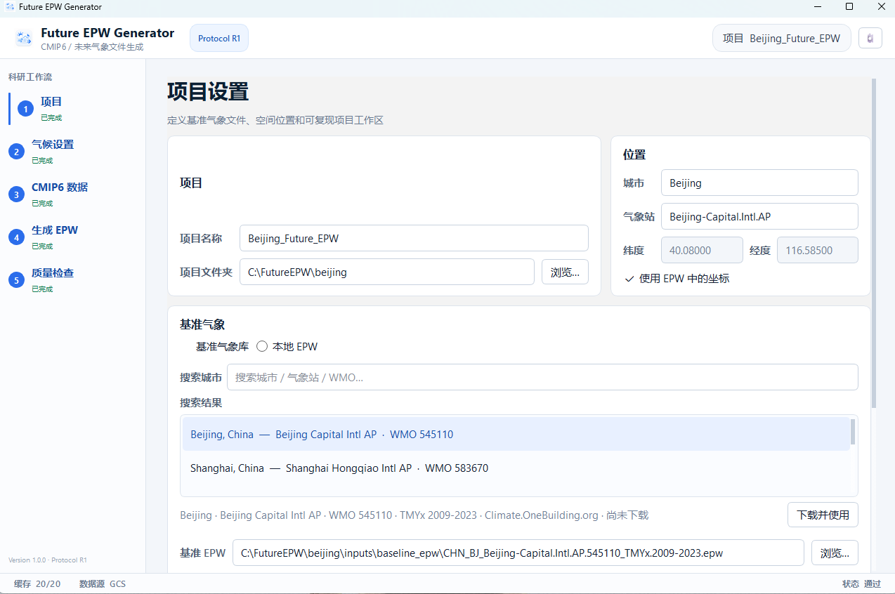
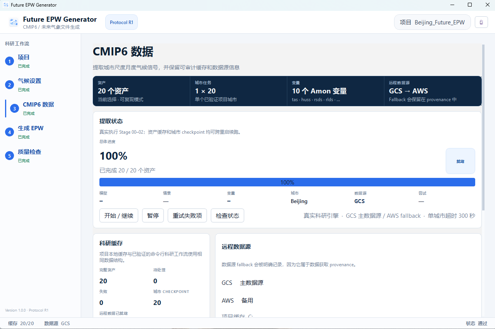

# Future EPW Generator

**Generate research-ready future EPW weather files from a validated baseline EPW and CMIP6 climate projections.**

Future EPW Generator is a Windows desktop application that turns a baseline EnergyPlus Weather (`.epw`) file into validated future-weather files through a reproducible CMIP6 workflow. It is designed for building-energy simulation, climate-impact assessment, and research workflows where provenance, resumability, and output validation matter.

**Windows · Protocol R1 · CMIP6 · EnergyPlus EPW · PySide6**

[Download v1.0.0](https://github.com/d2dmh/FutureEPWGenerator/releases/latest) · [Release notes](RELEASE_NOTES_v1.0.0.md) · [Build from source](WINDOWS_BUILD.md)

## What it does

```text
Validated baseline EPW
        ↓
Target city + project fingerprint
        ↓
CMIP6 climate selection
        ↓
Download / extract climate signals
        ↓
Climate morphing
        ↓
Future EPW generation
        ↓
Automated validation
        ↓
Research-ready EPW outputs
```

The application provides a GUI around the validated Stage 00–05 research workflow. It can acquire a recommended baseline EPW from the built-in Weather Library or use a local EPW, download the required CMIP6 variables with **GCS as the primary source and AWS as fallback**, resume interrupted data extraction, generate future EPWs, and run output checks before marking a project as complete.

## Interface preview

### Project setup and baseline weather

Search the built-in Weather Library, use a local EPW, and keep the target city separate from the actual weather station used as the baseline.



### CMIP6 data workflow

The CMIP6 page shows the active asset count, resumable progress, cache state, selected data source, and fallback provenance. In Advanced Mode, the total is driven by the actual GCM/SSP selection rather than a fixed catalog size.



## Quick start

1. Download `FutureEPWGenerator_Setup_v1.0.0.exe` from [Releases](https://github.com/d2dmh/FutureEPWGenerator/releases/latest).
2. Install and launch **Future EPW Generator**.
3. Create a project and choose a baseline EPW from the Weather Library or from disk.
4. Choose **Reproducible Mode** or a custom **Advanced Mode** selection.
5. Download the required CMIP6 assets. Interrupted jobs can be resumed.
6. Generate future EPWs.
7. Review the Validation page and only use outputs that pass the project checks.

> The v1.0.0 installer is currently unsigned, so Windows SmartScreen may display an unknown-publisher warning.

## Scientific workflow

```text
Stage 00  Environment + baseline EPW checks
   ↓
Stage 01  Selection-specific CMIP6 manifest
   ↓
Stage 02  CMIP6 extraction
          GCS primary → AWS fallback
          resumable cache + city checkpoints
   ↓
Preflight  Project / baseline / selection consistency
   ↓
Stage 03  Climate-factor construction
   ↓
Stage 04  Future EPW generation
   ↓
Stage 05  Output validation
```

The historical reference period is **1985–2014**. The current Protocol R1 catalog uses ten monthly CMIP6 Amon variables and the existing validated BTWS/BWS morphing implementation.

## Climate modes

### Reproducible Mode

The frozen R1 configuration uses:

- **5 GCMs:** ACCESS-CM2, GFDL-ESM4, MPI-ESM1-2-HR, IPSL-CM6A-LR, FGOALS-g3
- **3 scenarios:** SSP1-2.6, SSP2-4.5, SSP3-7.0
- **2 target periods:** 2040 and 2060
- **10 Amon variables**
- **200 Stage-02 weather assets**
- **36 generated EPWs** including ensemble-mean outputs

### Advanced Mode

Advanced Mode runs the same scientific workflow on a selected subset of GCMs, SSPs, and target periods.

Stage-02 asset count is:

```text
selected GCMs × (1 historical + selected SSPs) × 10 variables
```

Expected EPW count is:

```text
selected SSPs × selected periods × (selected GCMs + 1 ensemble mean)
```

For example, **1 GCM + 1 SSP + 1 period** requires **20 Stage-02 assets** and produces **2 EPWs**.

## Baseline Weather Library

The application includes a metadata catalog of recommended stations for major cities. Weather files are **not bundled with the application**; the selected TMYx EPW is downloaded on demand and cached locally.

After selection, the baseline EPW is copied into the project workspace and fingerprinted with SHA-256. The project therefore keeps a stable baseline input even if the remote weather source changes later.

Users can also browse and use any validated local 8760-hour EPW.

## Reproducibility and provenance

Future EPW Generator is designed to keep the generation chain auditable:

- baseline EPW copied into the project and SHA-256 fingerprinted;
- target city and weather station stored separately;
- selection-specific CMIP6 manifest;
- location-namespaced and resumable CMIP6 cache;
- GCS/AWS fallback recorded in provenance;
- compatible cache retained when Advanced Mode selections change;
- stale derived outputs separated from the active selection;
- Stage-05 validation checks generated EPWs before the project is marked complete.

## Output validation

The validation workflow checks the generated EPWs for items such as:

- expected file count;
- 8760 hourly records;
- missing-value conditions;
- physical-range checks;
- target-period consistency;
- baseline / generated-file integrity.

The GUI reports the project result as **PASS**, **PASS WITH WARNINGS**, or **FAIL** based on the validation stage.

## Data sources

- **Baseline EPW:** local user file or Weather Library metadata linked to Climate.OneBuilding.org TMYx files.
- **CMIP6 primary source:** Google Cloud Storage (GCS).
- **CMIP6 fallback:** AWS-hosted mirror where supported by the existing R1 engine.

Fallback use is recorded as part of project provenance rather than hidden from the user.

## Windows installation

Download the installer from the repository [Releases](https://github.com/d2dmh/FutureEPWGenerator/releases/latest):

```text
FutureEPWGenerator_Setup_v1.0.0.exe
```

The installed distribution contains:

```text
FutureEPWGenerator.exe   GUI
FutureEPWEngine.exe      Stage 00–05 background runner
```

End users do **not** need to install Python separately.

## Development

For development or scientific debugging from source:

```powershell
python -m pip install -r requirements.txt -r requirements-dev.txt
python app.py --self-test
python -m pytest -q tests
python app.py
```

The current dependency set requires **Python 3.12** for the reproducible Windows release environment.

## Repository layout

```text
app.py                    Application entry point
future_epw_demo/          GUI, project state, Weather Library, orchestration
engine_core/              Stage 00–05 research engine
assets/                   Application icons + Weather Library catalog
packaging/                PyInstaller + Inno Setup definitions
scripts/                  Windows build scripts
.github/workflows/        Windows release automation
tests/                    Application + packaging regression tests
docs/images/              README interface screenshots
```

For release/build details, see [RELEASE_NOTES_v1.0.0.md](RELEASE_NOTES_v1.0.0.md), [WINDOWS_BUILD.md](WINDOWS_BUILD.md), and [RELEASE_CHECKLIST_v1.0.0.md](RELEASE_CHECKLIST_v1.0.0.md).

## Citation

Citation metadata is provided in [`CITATION.cff`](CITATION.cff).
